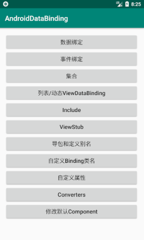

# Android DataBinding

## 项目功能列表

## 简单使用数据绑定
### 1、添加 Android DataBinding 支持
Android studio 需要在1.3以上，在module级别的gradle中添加大DataBinding支持

    android {

        dataBinding {
            enabled = true
        }
    }

### 2、在 xml 布局文件中绑定数据
使用 DataBinding 的xml布局文件和普通的布局文件唯一的区别就是根节点变为 `layout` ；然后增加了 `data` 节点，存放绑定的数据；其余的布局和普通的一样

    <?xml version="1.0" encoding="utf-8"?>
    <layout xmlns:android="http://schemas.android.com/apk/res/android"
        xmlns:app="http://schemas.android.com/apk/res-auto">

        <!-- 定义绑定的数据 -->
        <data>

        </data>

        <!-- 显示的布局 -->
        <LinearLayout
            android:layout_width="match_parent"
            android:layout_height="match_parent"
            android:orientation="vertical">

        </LinearLayout>

    </layout>

### 3、定义数据绑定对象

    public class UserBean {
        private String username;
        private String address;

        public UserBean(String username) {
            this.username = username;
        }

        public UserBean(String username, String address) {
            this.username = username;
            this.address = address;
        }

        public String getUsername() {
            return username;
        }

        public void setUsername(String username) {
            this.username = username;
        }

        public String getAddress() {
            return address;
        }

        public void setAddress(String address) {
            this.address = address;
        }
    }

### 4、在 XML 文件中定义数据

     <data>
            <variable
                name="user"
                type="com.renj.databinding.entity.UserBean" />
        </data>

### 5、Activity 类中修改
> ① 修改 `setContentView()` 方法为
`ActivityMainBinding binding = DataBindingUtil.setContentView(this, R.layout.activity_main);`
> ② 设置 XML 中需要的变量值 `binding.setUser(new UserBean("张三", "浙江省杭州市"));`
* **注意：类名 `ActivityMainBinding` 是根据布局文件名 "activity_main" 自动生成的，规则为：第一个字母大写，下划线去掉，下划线之后的第一个字母大写(驼峰式命名方式)，然后加上'Binding'，组成Binding类的类名。当然也可以自定义，<a href="#custom_class_name">点击查看</a>**

## 事件绑定
> 事件绑定

① 定义事件处理对象

    public class Presenter {
            public void click(View view) {
                int viewId = view.getId();
                if (viewId == R.id.bt_click1) {
                    UIUtil.showToast("通过id区分事件1");
                } else if (viewId == R.id.bt_click2) {
                    UIUtil.showToast("通过id区分事件2");
                }
            }

            public void clickMethod1(View view) {
                UIUtil.showToast("调用单个方法1");
            }

            public void clickMethod2(View view) {
                UIUtil.showToast("调用单个方法2");
            }

            public void lambdaMethod(View view) {
                UIUtil.showToast("Lambda表达式方式");
            }

            public void paramsMethod(View view, Context context, String params) {
                UIUtil.showToast(params);
            }
        }
② 在布局文件中定义并调用

    <layout xmlns:android="http://schemas.android.com/apk/res/android">
        <data>
            <variable
                name="presenter"
                type="com.renj.databinding.activity.EventBindingActivity.Presenter" />
        </data>

        <LinearLayout
            android:layout_width="match_parent"
            android:layout_height="match_parent"
            android:orientation="vertical"
            android:padding="@dimen/default_padding">

            <Button
                android:id="@+id/bt_click1"
                android:layout_width="match_parent"
                android:layout_height="wrap_content"
                android:onClick="@{presenter.click}"
                android:text="通过id区分事件1"
                android:textColor="@color/color_main_text"
                android:textSize="@dimen/default_text_size" />

            <Button
                android:id="@+id/bt_click2"
                android:layout_width="match_parent"
                android:layout_height="wrap_content"
                android:onClick="@{presenter::click}"
                android:text="通过id区分事件2"
                android:textColor="@color/color_main_text"
                android:textSize="@dimen/default_text_size" />

            <Button
                android:layout_width="match_parent"
                android:layout_height="wrap_content"
                android:onClick="@{presenter.clickMethod1}"
                android:text="调用单个方法1"
                android:textColor="@color/color_main_text"
                android:textSize="@dimen/default_text_size" />

            <Button
                android:layout_width="match_parent"
                android:layout_height="wrap_content"
                android:onClick="@{presenter::clickMethod2}"
                android:text="调用单个方法2"
                android:textColor="@color/color_main_text"
                android:textSize="@dimen/default_text_size" />

            <Button
                android:layout_width="match_parent"
                android:layout_height="wrap_content"
                android:onClick="@{(view) -> presenter.lambdaMethod(view)}"
                android:text="Lambda表达式方式"
                android:textAllCaps="false"
                android:textColor="@color/color_main_text"
                android:textSize="@dimen/default_text_size" />

            <Button
                android:layout_width="match_parent"
                android:layout_height="wrap_content"
                android:onClick='@{(view) -> presenter.paramsMethod(view,context,"params")}'
                android:text="传递参数"
                android:textColor="@color/color_main_text"
                android:textSize="@dimen/default_text_size" />

        </LinearLayout>

    </layout>

③ 设置XML需要的对象

    binding.setPresenter(new Presenter());

> 事件监听

与事件绑定类似，**不同的是参数要和监听的回调参数完全一致**。

① 定义事件处理对象

    public class Presenter {
            public void onEditTextChange(Editable editable) {
                        btContent.set("输入内容：" + editable.toString());
                    }
        }
② 在布局文件中定义并调用

    <layout xmlns:android="http://schemas.android.com/apk/res/android">
        <data>
            <variable
                name="btContent"
                type="android.databinding.ObservableField&lt;String>" />
        </data>

        <LinearLayout
            android:layout_width="match_parent"
            android:layout_height="match_parent"
            android:orientation="vertical"
            android:padding="@dimen/default_padding">

            <EditText
                android:layout_width="match_parent"
                android:layout_height="wrap_content"
                android:afterTextChanged="@{presenter.onEditTextChange}"
                android:hint="绑定 afterTextChanged 事件"
                android:textColor="@color/color_main_text"
                android:textColorHint="@color/color_main_hint"
                android:textSize="@dimen/default_text_size" />

            <TextView
                android:layout_width="match_parent"
                android:layout_height="wrap_content"
                android:text="@{btContent}"
                android:textColor="@color/color_main_text"
                android:textSize="@dimen/default_text_size" />

        </LinearLayout>

    </layout>

③ 设置XML需要的对象

    binding.setPresenter(new Presenter());

## 在 data 标签中导入类、定义别名

    <data>
        <import type="com.renj.databinding.entity.OneWayBean" />
        <import
            alias="User"
            type="com.renj.databinding.entity.UserBean" />
        <variable
            name="user"
            type="User" />
        <variable
            name="oneWayBean"
            type="OneWayBean"/>
    </data>

* **注意别名和定义的变量名不能相同**

## <a name="custom_class_name">自定义Binding类名</a>

     <!--自定义包名和类名-->
    <!--<data class="com.ren.databinding.custom.CustomClassNameBinding">-->
    <data class=".CustomClassNameBinding">

        <variable
            name="user"
            type="com.renj.databinding.entity.UserBean" />
    </data>

## 表达式
> 支持的运算符：

* 数学运算符： + - / * %
* 字符串拼接： +
* 逻辑运算符： && ||
* 二进制： & | ^
* 一元运算符： +
* 位运算符： >> >>> <<
* 比较： == > < >= <=
* instanceof
* ()
* 数据类型： character, String, numeric, null
* 类型转换（ClassCast）
* 方法回调（Method calls）
* 数据属性
* 数组：[]
* 三元操作符：? :

> 一些在java中常用而DataBinding xml中不支持的：

* this
* super
* new
* 泛型

> **“??”操作符：**

    android:text="@{user.displayName ?? user.lastName}"
它等于：

    android:text="@{user.displayName != null ? user.displayName : user.lastName}"

## 双向绑定

我们使用 `@{}` 时表示单向绑定，而使用双向绑定也很简单，使用 `@={}` 即可。
**前提：**
> 我们的数据对象需要继承 `android.databinding.BaseObservable` 类，并且做如下处理：
使用 `@Bindable` 注解标记 `getXxx` 方法，在 `setXxx` 方法中通知发生改变(notifyPropertyChanged)

    public class TwoWayBean extends BaseObservable {
        private String fastName;
        private String lastName;

        public TwoWayBean() {
        }

        public TwoWayBean(String fastName, String lastName) {
            this.fastName = fastName;
            this.lastName = lastName;
        }

        @Bindable
        public String getFastName() {
            return fastName;
        }

        public void setFastName(String fastName) {
            this.fastName = fastName;
            notifyPropertyChanged(BR.fastName);
        }

        @Bindable
        public String getLastName() {
            return lastName;
        }

        public void setLastName(String lastName) {
            this.lastName = lastName;
            notifyPropertyChanged(BR.lastName);
        }
    }

> 当然，当我们不想需要整个对象的字段都进行双向绑定，可以使用DataBinding框架提供的其他相关对象：

* ObservableBoolean
* ObservableByte
* ObservableChar
* ObservableShort
* ObservableInt
* ObservableLong
* ObservableFloat
* ObservableDouble
* ObservableParcelable
* ObservableField<T>
---
例：

    public final ObservableMap<String,String> observableMap = new ObservableArrayMap<>();
    observableMap.put("firstName","Zhang");
    observableMap.put("lastName","San");

#### 目前Android支持的双向绑定控件(其他的我们也可以自定义)：

 * AbsListView android:selectedItemPosition
 * CalendarView android:date
 * CompoundButton android:checked
 * DatePicker android:year, android:month, android:day
 * NumberPicker android:value
 * RadioGroup android:checkedButton
 * RatingBar android:rating
 * SeekBar android:progress
 * TabHost android:currentTab
 * TextView android:text
 * TimePicker android:hour, android:minute

